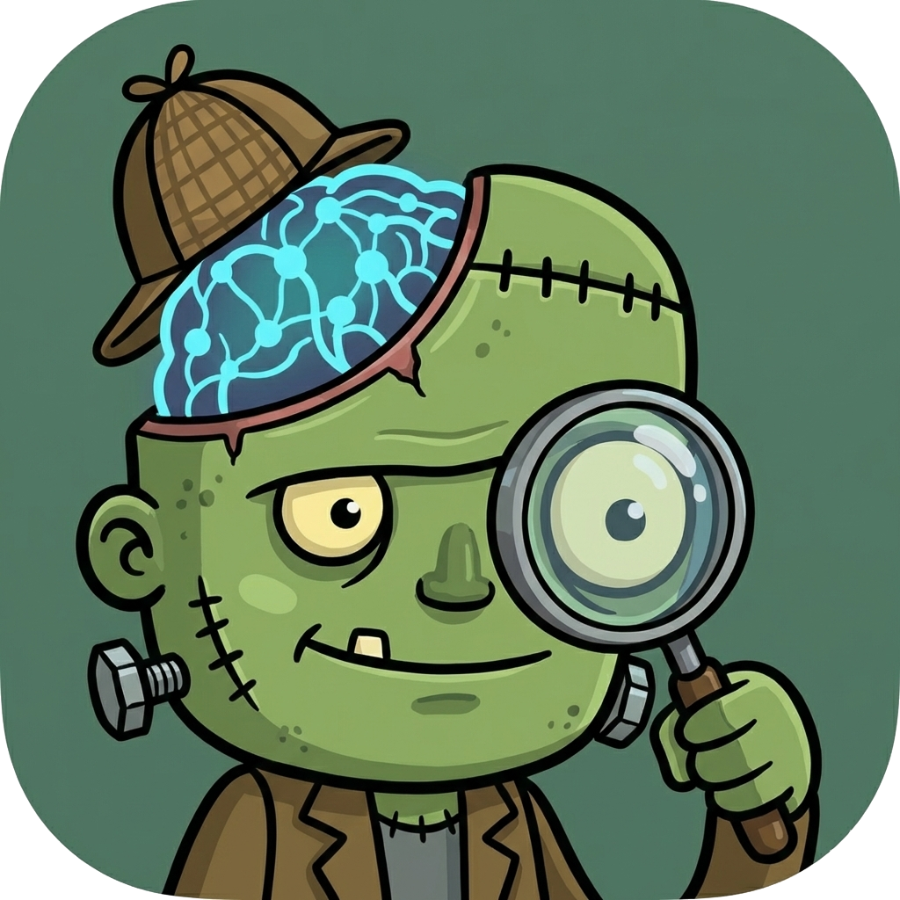
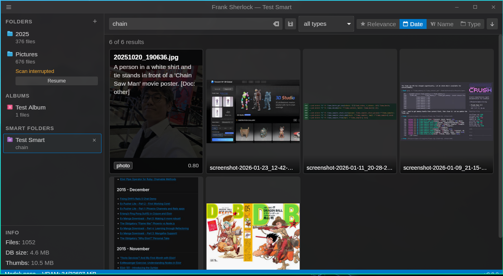

<p align="center">
  
</p>

# Frank Sherlock

Local-only, AI-powered image cataloging and search for your NAS. Point it at a directory, and it classifies every image using a local vision LLM, extracts text via OCR, generates thumbnails, and indexes everything into a searchable SQLite database. Nothing leaves your machine.

## What it does

- Scans image and PDF directories read-only (JPEG, PNG, GIF, BMP, WebP, TIFF, PDF)
- Classifies each image with Ollama's `qwen2.5vl:7b` vision model (media type, description, anime/manga identification, document detection)
- Extracts text via Surya OCR (with vision LLM fallback) for documents, receipts, screenshots
- Generates 300px JPEG thumbnails for fast browsing (PDF 2-page montage)
- Full-text search with SQLite FTS5
- Finds duplicate files -- exact matches by content fingerprint, near-duplicates by perceptual hash (dHash) + description similarity
- Detects renamed/moved files by fingerprint, so they don't get re-classified
- Resumes interrupted scans from the last checkpoint
- Live discovery progress during file walks on large directories

## Screenshot



The UI is loosely inspired by VSCode: custom titlebar, collapsible sidebar, thumbnail grid, media type filters, confidence slider, preview overlay, duplicate finder, and automatic light/dark theme.

## Installing from pre-built binaries

Download the latest release from the [Releases page](https://github.com/akitaonrails/FrankSherlock/releases): AppImage for Linux, DMG for macOS (Apple Silicon), MSI for Windows.

You also need [Ollama](https://ollama.com) installed and running (`ollama serve`). On first launch, the app prompts you to download the vision model if it isn't installed yet.

### Windows: SmartScreen warning

The MSI installer is not signed with a code-signing certificate. Windows SmartScreen may block it with a "Windows protected your PC" warning. Click "More info" and then "Run anyway" to proceed with installation.

## Requirements (for building from source)

- Linux, macOS, or Windows
- [Ollama](https://ollama.com) installed and running (`ollama serve`)
- NVIDIA GPU recommended on Linux/Windows (RTX series works well with qwen2.5vl:7b); Apple Silicon works natively on macOS
- Node.js 20+
- Rust 1.77+

## Building from source

```bash
# 1. Download the PDFium library for your platform
cd sherlock/desktop/src-tauri
bash scripts/download-pdfium.sh

# 2. Install frontend dependencies
cd sherlock/desktop
npm install

# 3. Start Ollama (in a separate terminal)
ollama serve

# 4. Run in dev mode
npm run tauri:dev
```

To produce a release binary (AppImage/DMG/MSI):

```bash
cd sherlock/desktop
npm run tauri:build
```

Output will be in `sherlock/desktop/src-tauri/target/release/bundle/`.

### Wayland/NVIDIA workaround

If the WebKit window is blank on Wayland with NVIDIA drivers:

```bash
WEBKIT_DISABLE_DMABUF_RENDERER=1 GDK_BACKEND=wayland,x11 npm run tauri:dev
```

## Tests

```bash
# Rust (227 tests)
cd sherlock/desktop/src-tauri
cargo test

# Frontend (204 tests)
cd sherlock/desktop
npm run test
```

Covers classification JSON parsing, thumbnail generation, incremental scanning, database operations, scan cancellation, query parsing, duplicate detection, similarity scoring, platform abstraction, and UI components.

## How it works

### Incremental scanning

Built for large NAS directories with 100k+ files:

1. **Discovery** -- walks the directory tree using only filesystem metadata (mtime, size) with zero file reads. WalkDir metadata is reused to skip redundant stat syscalls. Child root subtrees are skipped early via `filter_entry()`. Progress is reported live to the UI every 500 files.
2. **Processing** -- only new and modified files go through fingerprinting, classification, and thumbnail generation. Thumbnail + EXIF extraction run on a separate thread in parallel with the GPU-bound LLM classification. Moved files are detected by fingerprint and just update their path reference. Unchanged file markers are flushed in batch before processing starts, and progress is checkpointed after every file so interrupted scans resume where they left off.
3. **Cleanup** -- files no longer on disk are soft-deleted, and their cached thumbnails are removed.

Rescanning an unchanged 10k-image directory takes seconds.

### Duplicate detection

Find and remove redundant copies to reclaim disk space:

- **Exact duplicates** -- groups files with identical SHA-256 fingerprints. A keeper heuristic picks the oldest file with the shortest path.
- **Near-duplicates** -- perceptual similarity using dHash (difference hash) computed during thumbnail generation, combined with Jaccard word overlap on LLM descriptions (85% visual + 15% textual). Uses Union-Find for transitive grouping.
- **Group comparison** -- side-by-side preview of all files in a duplicate group with per-file metadata.
- **3-tier confidence coloring** -- green (exact, safe to delete), yellow (near >= 85%), red (lower, needs visual check).

### Classification pipeline

Each new image goes through several stages:

1. **Primary classification** -- 3-attempt strategy with progressive fallback prompts and regex salvage for malformed JSON
2. **Anime enrichment** -- conditional on media type; identifies series, characters, and canonical names
3. **OCR** -- Surya OCR (isolated Python venv) with vision LLM fallback; runs for documents, screenshots, and text-containing images
4. **Document extraction** -- regex + LLM extraction of dates, amounts, transaction IDs from OCR text

### Search

Full-text search across filenames, paths, descriptions, OCR text, and character/series names. Example queries:

- `anime ranma`
- `bank transfer 2024`
- `receipt santander`
- `screenshot confidence >= 0.8`

## Project structure

```
sherlock/                  <- Main application
  desktop/
    src-tauri/src/         <- Rust backend
      classify.rs          <- Ollama vision + Surya OCR pipeline
      thumbnail.rs         <- Thumbnail generation + dHash computation
      scan.rs              <- Incremental scanner with cancellation + discovery progress
      db.rs                <- SQLite + FTS5 + duplicate queries
      similarity.rs        <- dHash + description similarity + Union-Find grouping
      pdf.rs               <- PDFium text extraction + page rendering
      config.rs            <- App paths
      lib.rs               <- Tauri commands, auto-cleanup
      query_parser.rs      <- NL query parsing
      runtime.rs           <- Ollama/GPU status
      platform/            <- OS abstraction (clipboard, GPU, Python paths)
    scripts/
      surya_ocr.py         <- Isolated OCR script (bundled as Tauri resource)
    src/                   <- React frontend
      utils.ts             <- Shared utilities (basename, errorMessage)
      __tests__/fixtures.ts <- Shared test mock objects
_classification/           <- Python PoC of the classification pipeline
```

### Research and prototyping (historical)

These directories contain the A/B testing research that informed model selection and pipeline design. They aren't part of the main application.

```
_research_ab_test/
  scripts/                 <- A/B benchmark scripts
  docs/                    <- Research notes (IDEA.md, RESULTS.md, etc.)
  lib/                     <- Shared Python helpers
  results/                 <- Generated benchmark outputs (gitignored)
  test_files/              <- Test corpus (gitignored, see note below)
```

> **Note:** The test files (images, audio, video, documents) used for benchmarking are not included. They contained copyrighted media and personal documents. To re-run the benchmarks:
>
> 1. Add your own media files in `_research_ab_test/test_files/` with subdirectories like `images/`, `old_audio/`, `old_docs/`, `old_tvseries/`
> 2. Update the ground truth JSON files in `_research_ab_test/docs/` to match your corpus
> 3. Adjust the benchmark scripts as needed

The benchmark results (`_research_ab_test/docs/RESULTS.md`) show why `qwen2.5vl:7b` was chosen over `llava:13b` and `minicpm-v:8b` (80% type accuracy vs 33-50%), and why Surya was picked as primary OCR (95% reference similarity, better coverage than vision LLM alone).

## Data storage

All application data lives under `~/.local/share/frank_sherlock/`:

```
db/index.sqlite            <- SQLite database with FTS5
cache/thumbnails/          <- Generated thumbnails (mirrored path structure)
cache/classifications/     <- Classification cache
cache/tmp/                 <- Temporary files (GIF frames, etc.)
surya_venv/                <- Isolated Python venv for Surya OCR
```

Source directories are never modified. Frank Sherlock is strictly read-only.

## CI

GitHub Actions runs on every push and PR against main:

- Platforms: Ubuntu 22.04, macOS (latest), Windows (latest)
- Checks: `cargo test`, `cargo clippy`, `cargo fmt --check`, `npm run build`, `npm run test`, `cargo audit` (Linux only)

Releases are built on `v*` tags for Linux (AppImage), macOS (Apple Silicon DMG), and Windows (MSI).

## License

This project is licensed under the [GNU General Public License v3.0](LICENSE).
